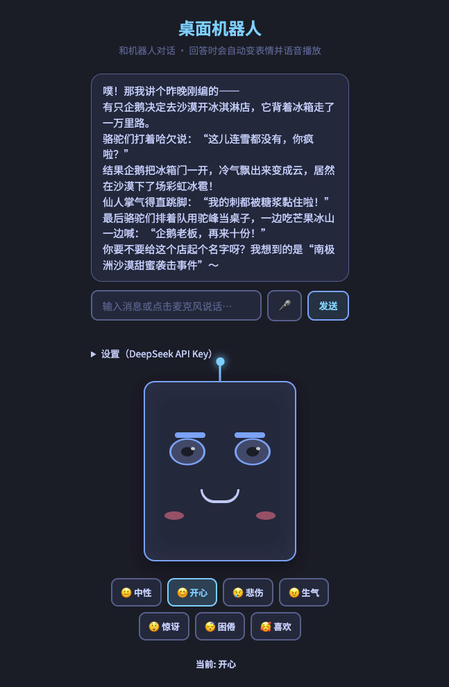
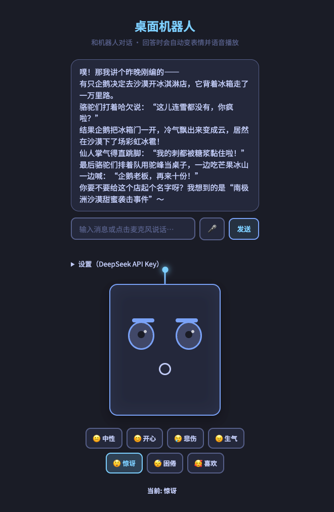

# 桌面机器人 · 面部表情

在浏览器中运行的桌面机器人：接入 **DeepSeek API** 对话，**根据回复内容自动切换表情**，并用 **语音朗读** 回复。

## Demo 演示

截图放在 `png/` 文件夹中：

| 主界面 | 对话与表情 |
|--------|------------|
|  |  |

请将实际运行截图命名为 `demo.png`（主界面）、`chat.png`（对话与表情）并放入 `png/` 目录，即可在 README 中显示。

## 功能

- **DeepSeek 对话**：输入文字或使用麦克风说话，机器人调用 DeepSeek 生成回复
- **根据回复内容动态切换表情**：模型在回复中为每一句/段标注表情标记，机器人会**随朗读进度按句切换**对应表情（中性 / 开心 / 悲伤 / 生气 / 惊讶 / 困倦 / 喜欢），长回复时多句话对应多种表情
- **语音播放**：使用浏览器 TTS 按段朗读回复，每段朗读时同步切换该段表情
- **语音输入**：支持浏览器语音识别（需 HTTPS 或 localhost），点击麦克风说话后点击发送
- **手动表情**：底部表情按钮可随时手动切换
- **自动眨眼**：随机间隔眨眼

## 使用前准备

1. **DeepSeek API Key**：在 [DeepSeek 开放平台](https://platform.deepseek.com/) 注册并获取 API Key。
2. 打开页面后点击 **「设置（DeepSeek API Key）」**，粘贴 Key 并点击 **「保存」**（仅保存在本机，不会上传）。

## 运行方式

### 方式一：直接打开（推荐）

双击 `index.html` 用浏览器打开，或：

```bash
open index.html
```

### 方式二：本地静态服务（若需避免部分浏览器对 file:// 的限制）

```bash
# 使用 Python 3
python3 -m http.server 8080

# 或使用 npx
npx serve .
```

然后在浏览器访问：`http://localhost:8080`（端口以实际为准）。

## 项目结构

```
robot-face/
├── png/         # Demo 演示截图（demo.png、chat.png 等）
├── index.html   # 页面结构
├── styles.css   # 样式与各表情状态
├── script.js    # 对话、表情与语音逻辑
└── README.md    # 说明
```

## 自定义

- **颜色**：在 `styles.css` 的 `:root` 中修改 CSS 变量（如 `--accent`、`--bg-dark`）。
- **表情**：在 `script.js` 的 `EXPRESSIONS` 中增删键值，并在 HTML 中增加对应按钮；在 CSS 中为 `.robot-head.expr-<名称>` 编写样式。
- **眨眼频率**：在 `script.js` 的 `startBlinkInterval` 中调整 `delay` 的计算（当前约 2–6 秒随机）。

## 技术说明

- **DeepSeek**：请求 `https://api.deepseek.com/v1/chat/completions`，通过 system 提示要求模型在回复的每一句/段前写 `[表情:xxx]`，前端解析出多段（内容 + 表情）后按段朗读并同步切换表情。
- **TTS**：使用浏览器 `speechSynthesis`，中文朗读依赖系统或浏览器提供的中文语音。
- **语音输入**：使用 `SpeechRecognition`（Chrome/Edge 等支持），需 HTTPS 或 localhost；Safari 支持有限。
- 表情通过为 `#robotHead` 添加/移除 `expr-<名称>` 类实现，由 CSS 控制眼睛、眉毛、嘴巴、腮红等形态。
- 字体使用 Google Fonts 的 Noto Sans SC（需联网加载）；若离线使用可改为系统字体或自托管字体。

## 许可

可自由修改与使用。
